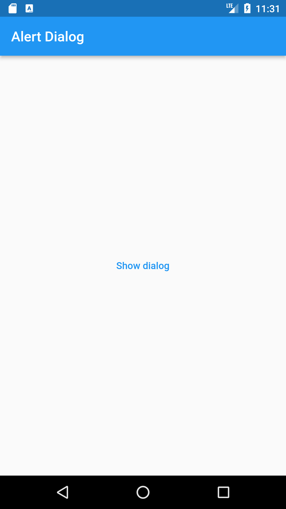
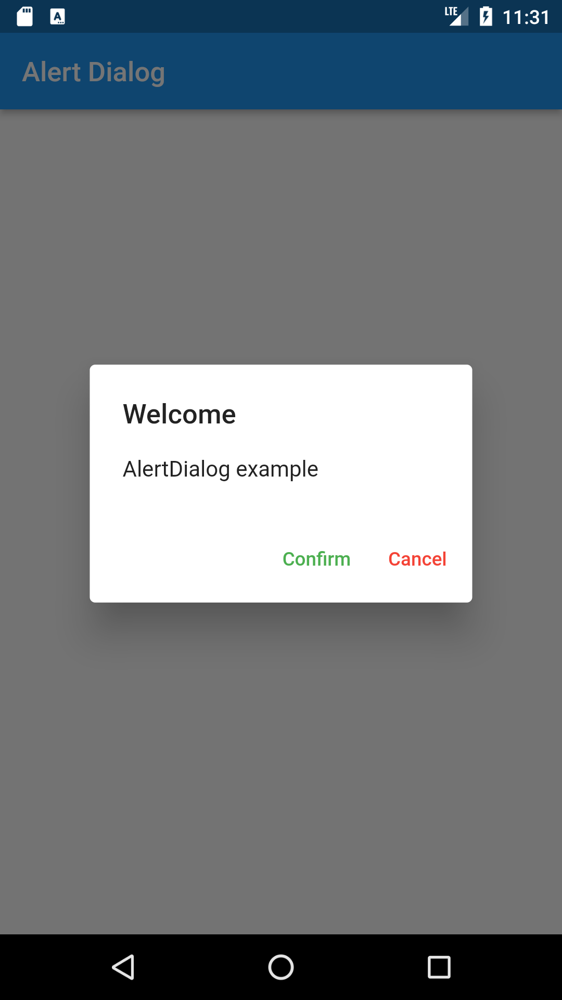

# Alert dialog 📄

Sample use of the widget AlertDialog and a little change the style of text the button.

    
    

I realized this with the [video](http://example.net/ "Dialogs") by **Luis Serrano Donaire**.

In my opinion, is really good material for beginners but the material is some old, therefore we must take into account the [documentation](https://api.flutter.dev/flutter/material/AlertDialog-class.html "Documentation AlertDialog").

>For this case the **expanded widget** isn't necessary.